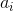

# A Simple Method of Terrain Generation for Lunar Lander

Note: This is an experimental method of generating lunar lander like terrain. There are probably better ways to do this. 

Terrain base shape is generated as the random superposition of trigonometric functions of the form:

  and  are randomly generated terms for each value of . The limit of the sum  determines how many different variations of base shape are possible, which is given by . However, the product  is the frequency of the trig function, thus larger values of  produce narrower peaks and thus a balance should be found. Further, the more terms are added the longer the generator will take to run.

 The terrain is then created by sampling the base shape function for a set of  values and can be rendered as a connected set of lines. To make the terrain more natural looking random deviations can be applied to the sampled values to give it a rougher look.

 Try it out here...

 https://imurf.github.io/lunar-lander-terrain-generation/

